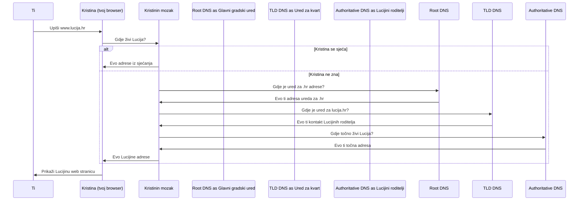
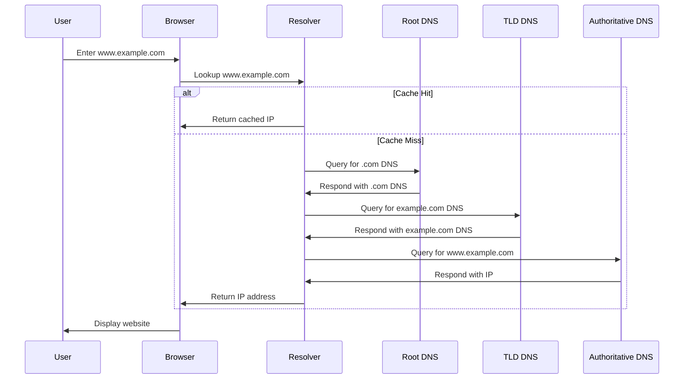

# Domain Name Server iliti simpl implementacija Gradskog Adresara

## Pričam ti priču

Želiš posjetiti prijateljicu, ali kako imaš nizak prostorni IQ, znaš samo njeno ime, a nemaš pojma adresu. 
To je kao da pitaš prijateljicu Kristinu koja iz nekog totalno non-creepy razloga se skoro uvijek sijeća gdje svi kolege iz razreda žive, ona ti kaže da se ništa ne brineš i da bude ona našla adresu, nađe adresu - i onda možete otići k Luciji.

Evo kako bi to izgledalo na internetu:

1. Ti (Korisnik) kažeš svom najdražem browseru na svom računalu (Kristini) da želiš posjetiti www.Lucija.hr.
2. Tvoje browser ti kaže iz svoje memorije ili - ako ne zna 🤔 - napravi par telefonskih poziva
3. Kristina prije ili kasnije dođe do adrese stranice (123.45.67.89).
4. Sad kad tvoje računalo zna adresu, možete otići tamo (🚶🚶🚶) i buljiti u Luciju. 

Naravno, kao i u razredu, postoji par pitanja:  
-  Kako Kristina zna gdje su sve te informacije? Tj. kako tvoj komp zna naciljati DNS servere sa dobrim pitanjima? 
-  Kako funkcionira komunikacija između Kristine i gradskog adresara? Kako ona to pita i browse-a adrese točno?

## In reality 

Prevedimo to sada na dobar stari dosadni internetski protokol: 

